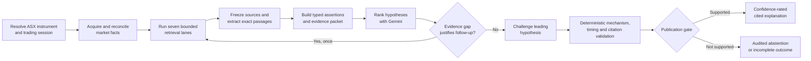

# ASX Investigation Agent

> Evidence-first investigation for unusual ASX equity moves.

Given an ASX ticker and trading date, the agent reconstructs the move, investigates a bounded set of possible drivers, and publishes a confidence-rated explanation in which every causal claim is tied to frozen evidence.

[Quick start](#recorded-demo-quick-start) · [Architecture](docs/architecture.md) · [Evaluation](docs/evaluation.md) · [Release status](docs/release-status.md)

[](https://github.com/ZhanlinCui/ASX-Investigation-Agent/actions/workflows/ci.yml)


## Why this exists

A price chart can show that a stock moved. It cannot establish why. The hard part is separating a plausible story from a time-eligible, source-backed explanation while prices, disclosures, corporate actions, sector effects and provider failures may disagree.

ASX Investigation Agent is a research workbench for professional analysts, technical reviewers and Agent product evaluators. It is designed to make the investigation inspectable: observed market facts, retrieved sources, rejected alternatives, coverage limits and confidence controls remain visible from the first retrieval lane to the final report.

It does not predict prices, recommend trades or execute orders.

## What makes the agent different

- **A narrow model boundary.** Gemini ranks evidence-bound hypotheses and challenges the leading candidate. Deterministic code owns ASX sessions, calculations, source timing, evidence IDs, claim publication and confidence caps.
- **Audited retrieval, not open-ended browsing.** Seven fixed driver lanes cover issuer disclosures, corporate actions, index changes, peers, macro inputs, analyst events and a no-catalyst control. One evidence-gap follow-up is permitted when justified.
- **Real abstention.** Missing primary evidence, incomplete providers, unresolved timing or material conflicts can produce `INSUFFICIENT_EVIDENCE` or `INCOMPLETE_DATA` instead of a fabricated catalyst.
- **Immutable evidence and replay.** Provider responses and source documents are content-addressed. Case versions, checkpoints and decision-ledger entries preserve provenance without exposing private model text.
- **Case-isolated memory.** Cross-case memory is restricted to allowlisted context such as provider health, policy versions and point-in-time issuer reference facts. Prior causal conclusions and holdout labels cannot enter a new case.

## Audited investigation workflow



The report is rendered only from validated public artifacts. Search queries, provider bodies, memory values, prompts, private model prose and chain-of-thought are never part of the public report.

## Four core design decisions

| Area | Product decision |
| --- | --- |
| Tools | Typed providers return success, empty, partial or explicit failure outcomes. Primary and fallback market sources are never averaged; material disagreements become conflict records. |
| Context | Long documents are frozen, passage-indexed and filtered into a bounded evidence packet of exact, time-classified snippets. Document instructions are untrusted data. |
| Memory | SQLite WAL stores immutable case versions and append-only events. Shared memory is allowlisted, point-in-time and context-only; case claims never transfer across investigations. |
| Evaluation | Deterministic unit, contract, adversarial and recorded suites protect safety invariants. Development gold, sealed holdout and Live approval are separate external gates and remain `NOT_RUN` until supplied. |

Read the concise rationale in [Four core decisions](docs/decisions/four-core-decisions.md).

## Product capabilities

- ASX trading-calendar and AEST/AEDT session resolution
- AUD market-move reconstruction and benchmark-relative facts
- EODHD primary market acquisition with typed failure semantics
- Corporate-action timing and mechanical-driver validation
- Safe PDF, HTML, text and controlled URL ingestion up to 20 MB
- Frozen evidence register with exact, version-scoped passage retrieval
- Ranked hypotheses, contradiction tracking and bounded challenge
- Confidence bands, completeness and deterministic caps shown separately
- Persistent archive, recoverable checkpoints and immutable child refinements
- Public JSON, Markdown, retrieval-plan and decision-ledger views
- Recorded, adversarial, provider-contract and frozen-corpus evaluation paths

## Technology

| Layer | Choice |
| --- | --- |
| Agent kernel | Python 3.12, typed state machine, Pydantic |
| API | FastAPI, SSE replay |
| Model | Gemini structured output behind a bounded reasoning contract |
| Storage | SQLite WAL, FTS5, SHA-256 content-addressed artifacts |
| Market data | EODHD primary; Marketstack fallback contract where configured |
| Discovery | Bounded connectors; discovery results cannot become primary causal evidence by themselves |
| Workbench | React 19, TypeScript, Vite, native CSS, Phosphor Icons |
| Quality | Pytest, Ruff, Vitest, ESLint, recorded policy sentinels |

## Recorded demo quick start

Requirements: Python 3.12, Node.js 22 and pnpm 10.

```bash
git clone https://github.com/ZhanlinCui/ASX-Investigation-Agent.git
cd ASX-Investigation-Agent

python3.12 -m venv .venv
.venv/bin/python -m pip install --upgrade pip==25.3
.venv/bin/python -m pip install -e '.[dev]'
pnpm --dir web install --frozen-lockfile

cp .env.example .env
PYTHONPATH=src .venv/bin/uvicorn asx_investigator.main:app --reload
```

In a second terminal:

```bash
pnpm --dir web dev
```

Open `http://localhost:5173`, choose **Recorded case**, and investigate `BHP` on `2026-08-20`. The recorded path does not require financial-data or model credentials.

## Live configuration

Secrets are backend-only environment variables. Copy `.env.example` to the ignored `.env` and configure only the providers you intend to use.

```dotenv
GEMINI_API_KEY=
GEMINI_MODEL=gemini-3-flash-preview
EODHD_API_KEY=
MARKETSTACK_API_KEY=
TAVILY_API_KEY=
```

External gold evaluation additionally requires a versioned AUD pricing schedule. See [Evaluation](docs/evaluation.md) before running a paid model path. Any key previously pasted into a chat, issue or log must be rotated before a credentialed gate.

## Evaluation status

| Gate | Current result | What it proves |
| --- | --- | --- |
| Python test suite | `PASS` | Deterministic domain, provider, persistence, Agent, memory, evaluation and public-boundary contracts |
| Recorded policy sentinels | `24/24 PASS` | Reproducible safety and workflow invariants on synthetic fixtures |
| Frontend tests and build | `PASS` | Workbench rendering and production compilation |
| External development gold, 24 cases | `NOT_RUN` | Requires the external point-in-time corpus and measured model path |
| Sealed holdout, 12 cases | `NOT_RUN` | Requires externally supplied blind labels and grading root |
| Credentialed Live approval | `NOT_RUN` | Requires rotated provider credentials and completed-session smoke cases |

The 24 recorded cases are synthetic policy sentinels, not historical accuracy evidence. Confidence is an ordinal `LOW / MEDIUM / HIGH` evidence-strength band, not a probability, and remains `UNCALIBRATED` until the external calibration protocol is completed. Current raw evidence is in [Release status](docs/release-status.md).

## Security and known limits

- This release candidate is single-user software for local or controlled review environments; it has no authentication or multi-tenant boundary.
- It provides investigation support, not investment advice, forecasts or trading execution.
- Historical cases can be incomplete when point-in-time primary sources are unavailable.
- Discovery coverage does not guarantee that every valid catalyst will be found. The product is expected to abstain when support is inadequate.
- Provider entitlement, rate limits, schema drift and conflicting bars are explicit report states, never silently converted to “no catalyst”.
- Evidence content is available only through a case-version-scoped endpoint; public summaries do not expose raw provider payloads or model internals.
- Report security issues through [GitHub Security Advisories](https://github.com/ZhanlinCui/ASX-Investigation-Agent/security/advisories/new). See [SECURITY.md](SECURITY.md).

## Documentation

- [Product](docs/product.md) — users, workflow, capabilities and boundaries
- [Product design](docs/product-design.md) — release workbench and interaction rules
- [Architecture](docs/architecture.md) — Agent kernel, retrieval, evidence, memory, confidence and recovery
- [Evaluation](docs/evaluation.md) — datasets, calibration and release gates
- [Release status](docs/release-status.md) — verified code state and external prerequisites
- [Master development plan](MASTER_DEVELOPMENT_PLAN.md) — delivered milestones and remaining approval work
- [Documentation index](docs/README.md) — current docs, phase records and reference material

## License status

Copyright © 2026 Zhanlin Cui. No open-source license has been granted. You may inspect this repository, but reuse, redistribution and derivative works require explicit permission from the copyright holder.
