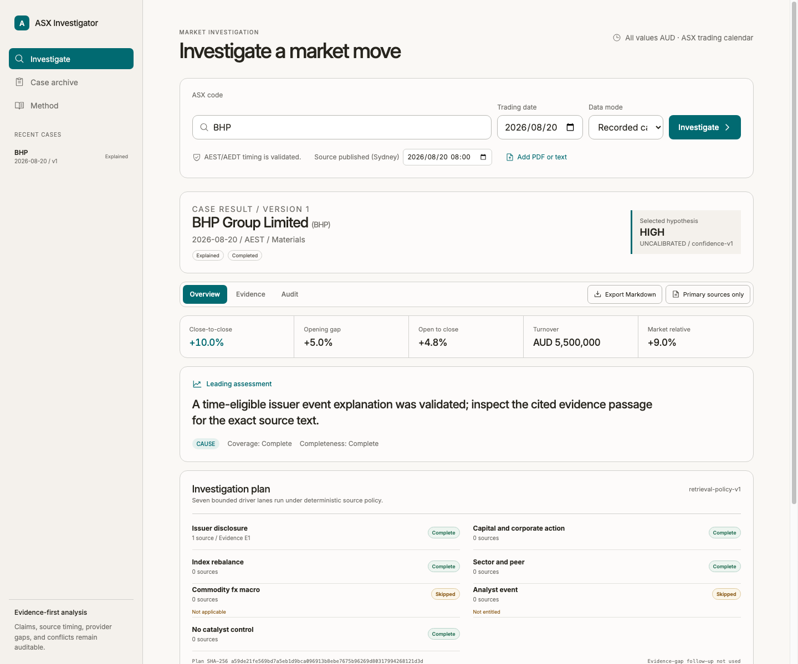
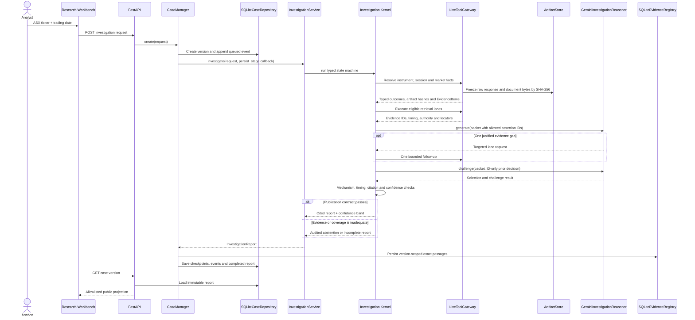
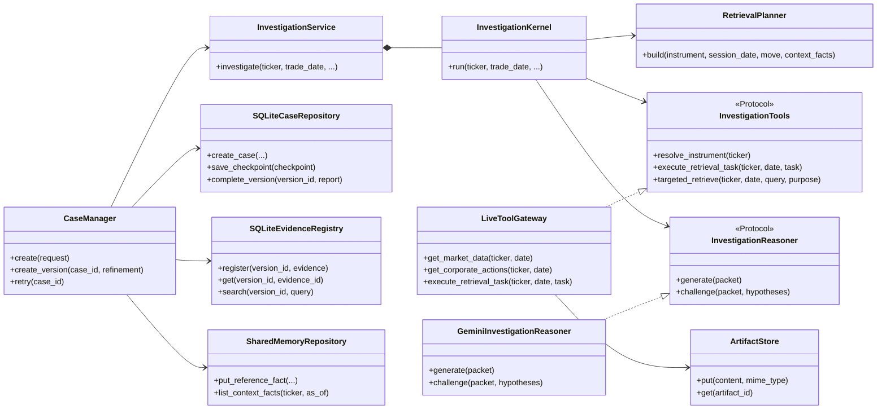
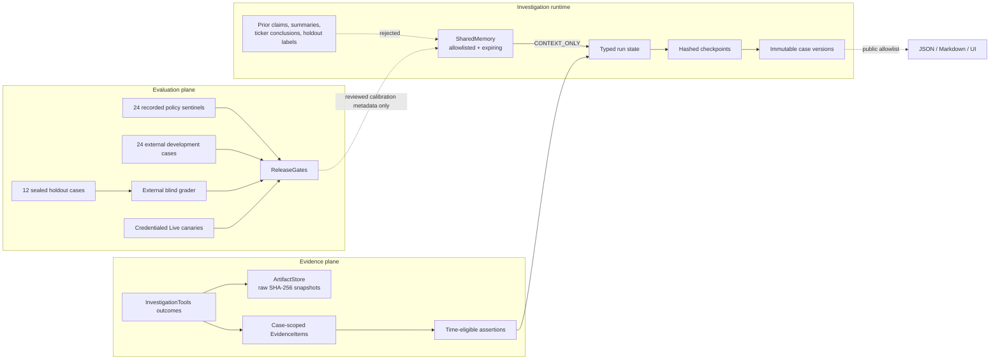

<h1 align="center">ASX Investigation Agent</h1>

<p align="center"><strong>Evidence-first investigation for unusual ASX equity moves.</strong></p>

<p align="center">
  A research workbench that turns a ticker and trading date into a confidence-rated,<br />
  citation-bound explanation with visible coverage, conflicts and abstention.
</p>

<p align="center">
  <a href="#recorded-demo-quick-start"><strong>Quick start</strong></a> ·
  <a href="#agent-architecture">Agent architecture</a> ·
  <a href="docs/evaluation.md">Evaluation</a> ·
  <a href="docs/release-status.md">Release status</a>
</p>

<p align="center">
  <a href="https://github.com/ZhanlinCui/ASX-Investigation-Agent/actions/workflows/ci.yml"></a>
  
  
  
</p>



## Why this exists

A chart establishes that a stock moved. It does not establish why. The explanation must survive four harder questions: Was the source available at the time? Is it authoritative? Does it fit the observed market signature? Did the investigation cover plausible alternatives?

ASX Investigation Agent is built for professional analysts, technical reviewers and Agent product evaluators. It reconstructs the move in AUD, investigates a controlled driver set and publishes only claims that resolve to frozen, time-eligible evidence. When the evidence contract is not met, it abstains.

It does not forecast prices, recommend trades or execute orders.

## The investigation method

The method is simple to state and strict in execution: establish the market truth, search a bounded causal surface, challenge the best explanation, then publish or abstain.



Seven fixed driver lanes form the initial search surface: issuer disclosure, capital and corporate action, index rebalance, sector and peer, commodity/FX/macro, analyst event and a no-catalyst control. Each lane is `COMPLETE`, `PARTIAL`, `FAILED` or `SKIPPED` with a reason. The Agent may make one targeted follow-up, not an open-ended search loop.

## Agent architecture

The product is a controlled investigation Agent, not a general tool-calling platform. Gemini performs two narrow reasoning operations. Deterministic code owns market facts, time, retrieval policy, evidence identity, publication and confidence.



The model cannot call a provider, calculate a return, create an evidence ID, change a source role, set confidence or publish arbitrary causal prose. The claim compiler reconstructs public statements from validated assertion spans. Search queries, provider bodies, memory values, prompts, private model prose and chain-of-thought stay outside the public report.

## Memory and evaluation boundary

Memory is separated by purpose. Case evidence and conclusions remain inside an immutable version lineage. Shared memory admits only allowlisted, point-in-time operational context and can never support a causal assertion. Evaluation data follows a separate path so a holdout cannot become product memory.



This boundary answers a central Agent question: what should improve across cases? Provider health, source policy, calendar rules and reviewed calibration metadata may persist. Historical causal claims, model summaries and sealed labels may not.

## What makes the agent different

| Product property | What the implementation does |
| --- | --- |
| Evidence-bound reasoning | Gemini selects registered assertion IDs; claims are compiled from exact cited spans. |
| Audited retrieval | The seven-lane plan, lane outcomes, plan hash and one follow-up decision are persisted. |
| Point-in-time integrity | ASX sessions and AEST/AEDT timing determine whether a source can support that trading day. |
| Conflict without averaging | Material provider disagreements remain visible and cap confidence. |
| Real abstention | Missing primary evidence, failed required providers and unresolved conflicts cannot become “no catalyst”. |
| Recoverable investigation | Typed checkpoints resume compatible work; incompatible state creates an audited child version. |
| Safe public surface | Reports expose allowlisted metadata; exact passages require both version ID and evidence ID. |
| Calibration discipline | `LOW / MEDIUM / HIGH` is an ordinal evidence-strength band and remains `UNCALIBRATED`. |

## Four core design decisions

| Area | Decision |
| --- | --- |
| Tools | Typed providers return success, empty, partial or explicit failure. Primary and fallback prices are never averaged; material disagreements become conflicts. |
| Context | Long documents are frozen, indexed and reduced to a small packet of exact, time-classified assertions. Instructions inside documents are untrusted data. |
| Memory | SQLite WAL stores immutable versions and append-only events. Shared memory is allowlisted, point-in-time and non-causal. |
| Evaluation | Domain, provider, adversarial and recorded suites protect the contract. Development gold, sealed holdout and Live approval remain separate external gates. |

The full rationale is intentionally short: [Four core decisions](docs/decisions/four-core-decisions.md).

## Product capabilities

- ASX trading-calendar and AEST/AEDT session resolution
- AUD market-move and benchmark-relative reconstruction
- EODHD primary market acquisition with typed failure semantics
- Corporate-action timing and mechanical-driver validation
- Safe PDF, HTML, text and controlled URL ingestion up to 20 MB
- Frozen evidence register and version-scoped exact passage retrieval
- Ranked hypotheses, contradiction tracking and bounded challenge
- Separate confidence, completeness, conflicts and deterministic caps
- Persistent archive, retryable checkpoints and immutable refinements
- Public JSON, Markdown, retrieval-plan and decision-ledger views

## Technology

| Layer | Choice |
| --- | --- |
| Agent kernel | Python 3.12, typed state machine, Pydantic |
| API | FastAPI, version-scoped evidence, SSE replay |
| Reasoning | Gemini structured output behind a two-call bounded contract |
| Storage | SQLite WAL, FTS5, SHA-256 content-addressed artifacts |
| Market data | EODHD primary; governed Marketstack fallback where configured |
| Workbench | React 19, TypeScript, Vite, native CSS, Phosphor Icons |
| Quality | Pytest, Ruff, Vitest, ESLint, recorded policy sentinels |

## Recorded demo quick start

Requirements: Python 3.12, Node.js 22 and pnpm 10.

```bash
git clone https://github.com/ZhanlinCui/ASX-Investigation-Agent.git
cd ASX-Investigation-Agent

python3.12 -m venv .venv
.venv/bin/python -m pip install --upgrade pip==25.3
.venv/bin/python -m pip install -e '.[dev]'
pnpm --dir web install --frozen-lockfile

cp .env.example .env
PYTHONPATH=src .venv/bin/uvicorn asx_investigator.main:app --reload
```

In a second terminal:

```bash
pnpm --dir web dev
```

Open `http://localhost:5173`, choose **Recorded case**, and investigate `BHP` on `2026-08-20`. The recorded path requires no financial-data or model credentials.

## Live configuration

Secrets are backend-only environment variables. Copy `.env.example` to the ignored `.env` and configure only the providers you intend to use.

```dotenv
GEMINI_API_KEY=
GEMINI_MODEL=gemini-3-flash-preview
EODHD_API_KEY=
MARKETSTACK_API_KEY=
TAVILY_API_KEY=
```

External gold evaluation also requires a versioned AUD pricing schedule. See [Evaluation](docs/evaluation.md) before running a paid model path. Rotate any key previously pasted into chat, issue text or logs before a credentialed gate.

## Evaluation status

| Gate | Current result | Meaning |
| --- | --- | --- |
| Python, lint, frontend and build | `PASS` | Local release-candidate contracts and compilation pass |
| Recorded policy sentinels | `24/24 PASS` | Synthetic workflow and safety invariants are reproducible |
| External development gold, 24 cases | `NOT_RUN` | Historical attribution and abstention are not yet measured |
| Sealed holdout, 12 cases | `NOT_RUN` | Blind generalization and calibration remain unapproved |
| Credentialed Live approval | `NOT_RUN` | Live provider and completed-session canaries remain open |

The 24 recorded cases are synthetic policy sentinels, not historical accuracy evidence. Confidence is an ordinal `LOW / MEDIUM / HIGH` evidence-strength band, not a probability. The current evidence is recorded in [Release status](docs/release-status.md).

## Security and known limits

- This release candidate is single-user software for local or controlled review. It has no authentication or multi-tenant boundary.
- Discovery is bounded and can miss a valid catalyst. Abstention is the safe result when support is inadequate.
- Historical cases can be incomplete when point-in-time primary sources are unavailable.
- Provider entitlement, rate limits, schema drift and conflicting bars remain explicit report states.
- The product supports investigation, not investment advice, prediction or trading execution.
- Report security issues through [GitHub Security Advisories](https://github.com/ZhanlinCui/ASX-Investigation-Agent/security/advisories/new). See [SECURITY.md](SECURITY.md).

## Documentation

- [Product](docs/product.md): users, workflow, capabilities and boundaries
- [Architecture](docs/architecture.md): kernel, retrieval, evidence, memory, confidence and recovery
- [Product design](docs/product-design.md): release workbench and interaction rules
- [Evaluation](docs/evaluation.md): datasets, calibration and release gates
- [Release status](docs/release-status.md): verified code state and external prerequisites
- [Master development plan](MASTER_DEVELOPMENT_PLAN.md): delivered milestones and remaining approval work
- [Documentation index](docs/README.md): current docs, phase records and reference material

## License status

Copyright © 2026 Zhanlin Cui. No open-source license has been granted. You may inspect this repository, but reuse, redistribution and derivative works require explicit permission from the copyright holder.
